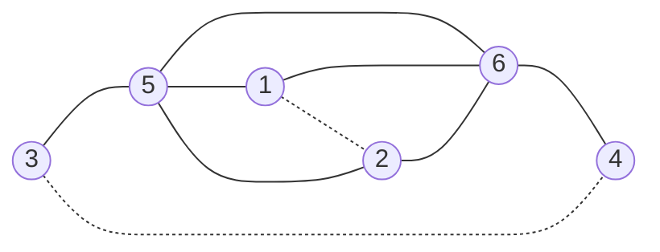

# Smallest network with a jointly harmful pair of additions

The two exact evaluators agree. Final verification status is recorded in the [evidence gate](.codex/evidence/runs/kemeny-pair-minimum-v1/gate-report.json). Publication novelty is unresolved.

Consider a random walk on a finite connected simple undirected unweighted graph. At each step it chooses a neighbor uniformly. Its Kemeny constant is the expected time to reach a destination sampled proportionally to its degree, with zero time to reach the starting vertex itself. Adding an edge changes both the transition probabilities and these destination weights.

The frozen question asks for the smallest graph with two distinct missing edges, each of which leaves this constant unchanged or decreases it when added alone, while adding both strictly increases it. A higher value is worse for this specific measure. This is a mathematical model; the study does not measure a real transport, communication, or biological network.

## Result

Both evaluators return minimum order **6**. The graph has base edges

    {1,5}, {1,6}, {2,5}, {2,6}, {3,5}, {4,6}, {5,6}.

Add `e = {1,2}` and `f = {3,4}`. Vertices `{1,2,5,6}` form a diamond, with a leaf at each of vertices 5 and 6.



Solid lines are the seven base edges. Dashed lines are the proposed additions.

| Graph | Exact Kemeny constant | Change from base |
| --- | --- | --- |
| Base | 135/28 | 0 |
| Add e | 77/16 | -1/112 |
| Add f | 135/28 | 0 |
| Add both | 1229/252 | +1/18 |

The exactly neutral `f` is essential. This example does not satisfy the different requirement that both single additions strictly decrease the constant.

## Why the finite computation can establish a minimum

The census covers every unordered pair of distinct nonedges of every connected graph representative on two through six vertices: 142 representatives and 2,390 marked pairs. It retains pairs sharing a vertex, automorphic duplicates and graphs with no admissible pairs. Exactly one pair qualifies in this enumeration, at order six; none qualifies at a smaller order.

Completeness is checked by constructing the full vertex-permutation orbit of each representative, verifying that these orbits are disjoint, and comparing their union with an independently enumerated set of all connected labelled graphs of that order. Agreement with a catalogue's advertised counts alone would not suffice.

A six-vertex witness plus exclusion of every smaller order proves the minimum over the stated graph class. Larger graphs cannot lower that minimum. The study does not classify graphs with seven or more vertices. Graphs with at most one vertex cannot supply two distinct missing edges.

The author computes exact effective resistances from a grounded Laplacian inverse and uses `K = d^T R d / (4m)`. The independent evaluator uses its own graph decoder and exact characteristic-polynomial calculation: if `q(x) = det(xI - (I-P))/x`, then `K = -q_1/q_0`. Their 1,848 graph-state values and all 2,390 pair records agree exactly, including signs and zero changes. The independent outputs were sealed before the author outputs were released to that evaluator.

These are known evaluation methods, with no algorithm-speedup claim. The final reviewer is separate from both implementers. The sealed raw outputs preserve their original provisional labels; final status will be recorded separately rather than rewriting that history.

The reviewer identified one procedural deviation: the original author run used an author-owned logging wrapper, although the frozen contract required an auditor-owned wrapper. A documented corrective run uses the independent auditor's already sealed wrapper and the unchanged author implementation, inputs and environment. Its five output files are byte-identical to the originals. The [correction record](evidence/kemeny-pair-minimum/process-correction/comparison.json) retains the original deviation, the new logs and an inherited-environment warning from uv. The independent reviewer accepted the correction after checking its freeze, wrapper ownership, all 42 unchanged pins, raw logs and exact output equality. The actual Windows arguments differ from the frozen path spelling only by equivalent slash separators.

## Secondary corollary: requiring both individual changes to improve

If both singleton additions must strictly decrease the constant, the minimum is **7**. This is a post-hoc deduction from the unchanged outputs, not a change to the frozen primary question or a new graph search.

Every strict-singleton witness would also satisfy the original nonincreasing-singleton condition. The complete census has no such weak witnesses below six, and its sole six-vertex witness has an exactly neutral singleton. Hence there is no strict-singleton witness through six. The fixed published P7 has changes `-1/14`, `-1/14` and `+1/24`, so it supplies a seven-vertex witness. Lower exclusion and that witness together prove the strict variant's minimum. The independent reviewer checked this implication separately; publication novelty remains unresolved.

## What was already known

Faught, Kempton and Knudson give a seven-vertex path whose two specified additions are individually non-Braess and jointly Braess, immediately after Corollary 4.3 of [A 1-Separation Formula for the Graph Kemeny Constant and Braess Edges](https://arxiv.org/html/2108.01061v1). The fixed replay here reproduces that published example. The phenomenon and that example are not discoveries of this project.

The prospective added fact is the exact minimum for the explicitly nonincreasing-singleton predicate. Targeted source reviews have found no exact minimum theorem within their inspected sources. That limited search does not establish publication novelty or that the problem was previously open. See the recorded [initial review](evidence/kemeny-pair-minimum/evidence/prior-art/source-notes.json), [citation follow-up](evidence/kemeny-pair-minimum/evidence/prior-art/supplement-2306.04005.json), [independent post-result review](evidence/kemeny-pair-minimum/evidence/prior-art/post-result/verdict.md), and [root post-result notes](evidence/kemeny-pair-minimum/evidence/prior-art/post-result-root-notes.json).

[Hu and Kirkland's 2019 paper](https://mspace.lib.umanitoba.ca/server/api/core/bitstreams/04a4246d-2b67-4e4c-9c4b-60f0c5417031/content), especially Example 2.0.2 and Theorem 3.1.2, already treats neutral edge additions and gives a formula for joining nonadjacent twins. Our vertices 1 and 2 have the same neighbors, so that addition is an instance of their known framework. No new twin-edge formula or Braess-set concept is claimed.

## How this connects to the atlas

This study connects random walks, hitting times, electrical resistance and graph changes. The map adds source-backed definitions and a learning journey through these connections. A concrete human contribution is deciding whether degree-weighted destinations and this transition rule represent an application's actual objective; the computation does not make that modelling decision.

The long-term mapping and discovery goal remains active. This finite result is neither a complete mathematical map nor demonstrated real-world impact.

## Reproduction and evidence

The [frozen contract](evidence/kemeny-pair-minimum/docs/contract-v1.md) fixes the graph class, strictness convention, input hashes, full enumeration and two independent methods. Original commands, environments, logs and outputs are retained under `author/` and `independent/`; the [complete comparison](evidence/kemeny-pair-minimum/independent/comparison-01/comparison.json) checks every stored state and pair. The [evidence bundle](.codex/evidence/runs/kemeny-pair-minimum-v1/bundle.json) records the final verification status.

The portable package preserves both frozen mathematical implementations. A thin author entry point replaces only the machine-specific contract path with a hash-identical packaged contract; the independent implementation uses its existing command line. The integration replay reproduces all 11 baseline files byte-for-byte and rejects an already existing output directory before launching either census. The evidence gate records the final independent adapter review.

From the repository root, the portable command is:

```text
uv run --project experiments/kemeny-pair-minimum/independent --frozen python experiments/kemeny-pair-minimum/reproduce.py --output-dir work/kemeny-pair-run
```

Use a fresh output directory for each run. Environments are isolated with uv; the retained Windows run used Python 3.12.11 and the D-drive cache. GitHub CI runs the same command on Ubuntu and retains its raw outputs separately. The original staged computation commands remain historical records, including their original D-drive paths.
