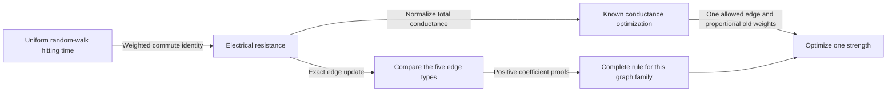

# Choosing a repair link and its strength

The [unit-link rule](kemeny-uniform-repair.md) extends to every positive
link strength. In the same damaged three-group-plus-hub network, the best
location is unchanged: connect to the damaged vertex when all groups are
equal; otherwise connect two vertices in a largest group. We can also
choose the best strength for that location, with an exact formula.

The strength is a conductance: the random walk chooses an incident link
with probability proportional to its conductance. The objective stays the
mean number of walk steps between independent uniformly chosen vertices.
This is a mathematical design model without a monetary charge for strength.

## Exact fixed-strength theorem

Let H=(K_(a,b,c) join K1)-uh, with integer 3<=a<=b,c, u in the a-part A
and h the hub. All remaining edges have conductance one. Let n=a+b+c+1
and m=ab+ac+bc+a+b+c-1. For a missing edge e, H+t e inserts that edge
with conductance t>0. Every candidate uses the same prescribed t.

Define U as the mean first hitting time for independent uniform start and
target, including zero self-hit. For every t>0, its minimizing edge set is:

- all a-1 pairs {u,v}, v in A excluding u, if a=b=c;
- all internal pairs in every original part of size max(b,c), otherwise.

There are binomial(q,2) choices per largest part in the second case. Tied
largest parts contribute both sets. Allowing or forbidding restoration of
uh does not change the optimum. These are sets of edges, not unique
individual edges. At t=0 every choice represents the same unchanged H;
the fixed-positive-strength theorem excludes that boundary.

Only the maximizing locations are invariant. The ordering of the worse
choices can change with t.

## From random walks to established optimization methods

For v_e=e_i-e_j put

    T = tr(L_H^+),   r_e = v_e^T L_H^+ v_e,
    s_e = v_e^T (L_H^+)^2 v_e.

The weighted commute identity and the rank-one Laplacian inverse update give

    U(H+t e) = (2(m+t)/n) [T - t s_e/(1+t r_e)].

For common positive t, minimizing U therefore maximizes s_e/(1+t r_e).
The factor m+t matters when the strength itself changes. These tools are
known: [Chandra et al., Theorem 2.2](https://homes.cs.washington.edu/~ruzzo/papers/resist.pdf)
supplies the weighted walk connection, and
[Monnig and Meyer, Theorem 2 and section 8.1](https://arxiv.org/pdf/1605.01091)
gives exact resistance-update and insertion-optimization machinery.

There is also a direct connection to established conductance allocation.
Rescaling every conductance by 1/(m+t) preserves the walk. With
alpha=t/(m+t), the old normalized weights are (1-alpha)/m and the new
edge weight is alpha. This is an affine line in the unit-total-conductance
simplex. The normalized Kirchhoff index is
n(m+t)tr((L_H+t v_e v_e^T)^+), proportional to U. Thus strength tuning is
a constrained slice of the framework studied by
[Ghosh, Boyd and Saberi, equation 2](https://stanford.edu/~boyd/papers/pdf/eff_res.pdf).
The normalization argument is our explicit inference from the known model;
we do not claim that paper states this particular family rule or radical.



The intact inverse uses established complete-multipartite spectral formulas.
Also H=X join K_(b,c), where X is the subgraph on A and h, and every
admissible insertion stays inside one factor. General join formulas may
therefore evaluate all candidates. Some named join-theorem hypotheses
remain inaccessible; X is disconnected before repair and for several
insertion types. The [source notes](../evidence/kemeny-weighted-repair/source/README.md)
record these overlaps and remaining access gaps.

## Six full-domain comparisons

Put d=n-a, k=(n-1)(d-1)/(nd), and
W=[n(n-1)+d(d-1)]/(n^2 d^2). The independently audited inverse gives:

| Edge type | r | s |
|---|---|---|
| Restore uh | (1-k)/k | W/k^2 |
| A pair incident to u | 2/d+1/(d^2 k) | 2/d^2+2/(d^3 k)+W/(d^2 k^2) |
| Untouched pair in a part of size q | 2/(n-q) | 2/(n-q)^2 |

These five types exhaust the missing edges. Part-preserving permutations
fixing u,h preserve U and are transitive within each type. All r,s and
the denominators 1+t r are positive.

For types i,j, the sign of their normalized score difference is the sign of

    (s_i-s_j) + t(s_i r_j-s_j r_i).

The following six numerator/denominator identities have complete positive
coefficient certificates in
[uniform-weighted.json](../experiments/kemeny-one-deletion-proof/uniform-weighted.json):

| Comparison | Component | Numerator terms | Positive constant |
|---|---|---:|---:|
| incident A > restoration | intercept | 7 | 16 |
| incident A > restoration | slope | 16 | 68 |
| incident A > untouched A | intercept | 20 | 1212 |
| incident A > untouched A | slope | 10 | 192 |
| larger B > incident A | intercept | 77 | 63406 |
| larger B > incident A | slope | 50 | 8036 |

For the first four rows substitute a=3+x,b=3+x+y,c=3+x+z. For the last
two substitute a=3+x,b=4+x+y,c=3+x+z. Every variable is nonnegative;
every listed numerator and denominator coefficient and constant is positive.
The checker verifies complete rational identities by integer cross-products.
Therefore both affine coefficients are strictly positive on their whole
domains, giving the comparison for every t>0. The larger-B substitution
covers b>a because sizes are integers; B/C exchange covers c>a.

For untouched pairs the score is 2/[(n-q)(n-q+2t)], strictly increasing
with part size q. This monotonicity and the six signs prove precisely the
announced maximizing sets, including ties and a=3. No sampled weight range
is being used to infer the universal statement.

At (4,4,6), restoration and an untouched A pair exchange order at t=12.
At that crossing their scores, and the B score, are 2/385; the incident-A
score is 1093/195580 and the C score is 2/297. C remains strictly best.
Independent full grounded matrices verify these exact values and the
crossing. This eliminates invariance of the entire ranking while preserving
the theorem about the best location.

## Exact joint optimum over location and strength

Now allow t>=0 with no cost penalty, so t=0 includes doing nothing. For any
edge in the optimal set above, write r=r_e,s=s_e and choose

    t* = [sqrt(s(mr-1)/(rT-s))-1]/r.

This strength is real, strictly positive, finite and unique. Every edge in
the stated optimal set with this common strength is a joint global
minimizer; there are no others. Equivalent edges have the same r,s.
Restoration permission still does not change this result.

Here is the analytic proof. On the subspace orthogonal to the constant
vector, L_H^+ has n-1>=2 positive eigenvalues lambda_i. Writing an edge
vector in this eigenbasis with coordinates c_i gives

    B = rT-s = sum_i c_i^2 lambda_i sum_(j!=i)lambda_j > 0.

Let A=T-ms and f(t)=(m+t)[T-ts/(1+rt)], so U=2f/n. The already proved
[best-unit-versus-no-action theorem](kemeny-uniform-repair.md) gives
f(1)-f(0)=(A+B)/(1+r)<0. Thus A<0. The portable checker also verifies
the three unchanged full-domain certificates establishing this premise.

Elementary differentiation gives

    f'(t) = [A+B(2t+rt^2)]/(1+rt)^2.

The numerator strictly increases on t>=0, starts negative, and tends to
positive infinity. Its unique zero is the displayed t*. The radicand
exceeds one because

    s(mr-1)/(rT-s)-1 = r(ms-T)/(rT-s) > 0.

Consequently f decreases until t* and increases after it. No action is
strictly inferior, and f(t)/t tends to B/r>0 as t tends to infinity.
For every positive t, any excluded edge has larger U than an optimal-set
edge at that same t; the latter is no better than its value at t*.
This pointwise comparison proves the joint global statement, rather than
only a stationary point for a preselected edge.

For (3,3,3), an incident-A edge has
m=35,T=751/630,r=59/189,s=587/11907 and

    t* = (189/59)[sqrt(1573160/1037853)-1].

It satisfies 0<t*<1: the derivative at 1 is 66587/538160>0, while the
derivative at zero is negative. This exact example rejects unit strength
as a universal optimum. It does not establish a universal upper bound of
one on t*. The generic scalar-calculus formula is a corollary of known
update machinery; its method is not claimed as a new optimization algorithm.

## Reproduction and contribution boundary

From the repository root, with a fresh output name:

```powershell
$env:UV_CACHE_DIR = 'D:/CodexWorkspaces/mathematics-atlas/uv-cache'
uv run --project experiments/kemeny-one-deletion-proof --frozen python experiments/kemeny-one-deletion-proof/verify_weighted_repair.py --weighted-certificate experiments/kemeny-one-deletion-proof/uniform-weighted.json --noop-certificate experiments/kemeny-one-deletion-proof/uniform-noop.json --output work/kemeny-weighted-repair/check-01.json
```

Python3.12.11 is pinned with no package dependencies. Other hosts may use
another cache path. Exact certificate checks establish the six weighted
signs and three no-op signs. The graph reduction, exhaustive edge sets,
generic calculus and joint global-optimum argument have separate independent
mathematical audits; they are not inferred from finite diagnostics.

The [evidence index](../evidence/kemeny-weighted-repair/README.md) retains
frozen hypotheses, raw successful and failed runs, complete coefficient
lists, independent audits and the changed implementation review. Prior
release bundles remain associated with their historical commits.

The potential mathematical contribution is the specific family-wide
weighted location rule and its joint-optimum consequence. Generic inverse
updates, normalized resistance optimization and differentiation are known.
Bounded searches leave publication priority unresolved. No measured physical
latency, throughput, nonuniform-workload optimum, multiple-insertion result,
or Lean formalization is claimed.
